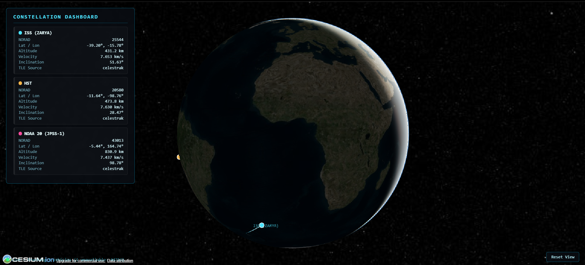
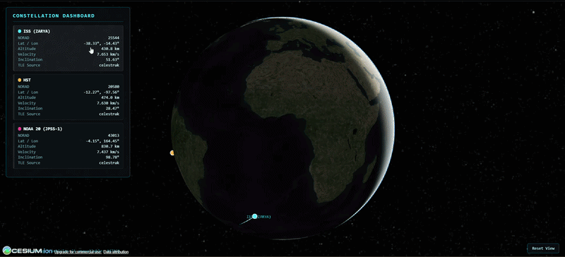
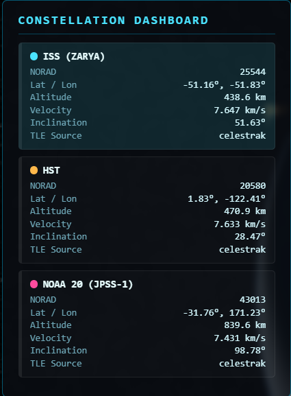
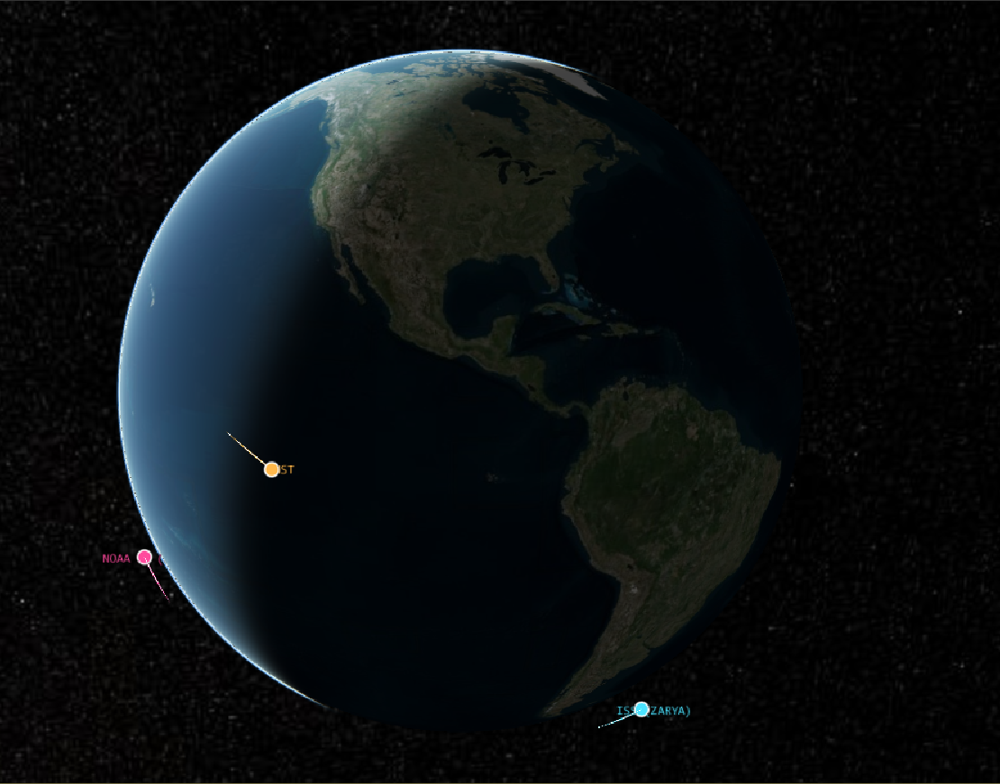
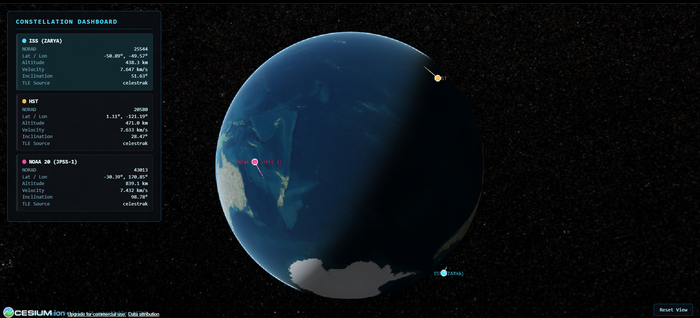

# 🛰️ LEO Constellation Tracker

**Real-time 3D visualization of Low Earth Orbit satellites — ISS, Hubble, NOAA-20, and Starlink — rendered live on a CesiumJS globe, powered by a FastAPI + Skyfield backend with resilient TLE caching.**

Track exact real-world satellite positions updated every 2 seconds, click any vehicle to fly the camera directly to it, and compare live telemetry — altitude, velocity, and inclination — across an entire constellation from a single dashboard.


> **Screenshot to take:** A full-window capture of the dashboard at rest — globe centered, 3–4 satellites visible with their glowing orbit trails, and the sidebar HUD showing telemetry cards. This is the first thing visitors see, so pick a moment where at least one satellite is clearly mid-globe (not hidden behind the Earth) and the lighting/day-night terminator is visible for visual interest.

---

## ✨ Features

- **Real-Time Telemetry** — Live latitude, longitude, altitude, velocity, and orbital inclination for every tracked satellite, recomputed from TLE orbital elements every 2 seconds using Skyfield's SGP4 propagator.
- **Multi-Satellite Tracking** — Simultaneously tracks and renders an entire mini-constellation (ISS, Hubble, NOAA-20, Starlink-1007) with independent orbit trails, colors, and labels for each vehicle.
- **Resilient TLE Caching** — Each satellite's orbital elements are fetched from CelesTrak and cached server-side for 10 minutes with per-satellite `asyncio.Lock` guards, preventing redundant API calls and CelesTrak rate-limiting even under rapid frontend polling.
- **Graceful Fallback Handling** — If CelesTrak is unreachable, the backend falls back to the last known cached TLE, then to a hardcoded fallback if configured — and transparently omits a satellite from the response rather than ever fabricating fake position data.
- **Click-to-Focus Camera Controls** — Click any satellite's card in the sidebar to smoothly fly the camera to its exact real-time position in orbit, with a one-click "Reset View" to return to the full-globe view.
- **Locked, Distraction-Free Globe** — Camera panning/tilting is disabled so the Earth always stays centered on screen; only zoom and rotate are enabled, giving it a clean "mission control" feel instead of a free-roam map.
- **Depth-Correct Rendering** — Satellites and their orbit paths are properly occluded by the Earth when passing behind it — no "X-ray vision" through the globe.


> **GIF to take:** Screen-record clicking a satellite card in the sidebar (e.g., Hubble) and let it play through the full camera flyTo animation until it settles close to the satellite. 5–8 seconds is plenty. This is the single most "wow" moment of the project, so it deserves a GIF, not a static image.

---

## 🧰 Tech Stack

**Backend**
- [Python 3.10+](https://www.python.org/)
- [FastAPI](https://fastapi.tiangolo.com/) — async REST API framework
- [Uvicorn](https://www.uvicorn.org/) — ASGI server
- [Skyfield](https://rhodesmill.org/skyfield/) — SGP4 orbital propagation and satellite position/velocity computation
- [httpx](https://www.python-httpx.org/) — async HTTP client for CelesTrak requests
- [CelesTrak](https://celestrak.org/) — source of live TLE (Two-Line Element) orbital data

**Frontend**
- HTML5 / vanilla JavaScript (single-file, no build step)
- [CesiumJS](https://cesium.com/platform/cesiumjs/) — 3D globe rendering, imagery, and camera control
- [Cesium Ion](https://ion.cesium.com/) — base imagery and terrain hosting

---

## 📸 More Screenshots


> **Screenshot to take:** A close-up crop of just the sidebar HUD showing 3–4 satellite cards with their color swatches, NORAD IDs, lat/lon, altitude, velocity, and inclination values clearly readable. Zoom your browser in slightly first so text is crisp.


> **Screenshot to take:** Zoom the camera out until the whole Earth is visible with multiple glowing orbit trails arcing around it. This shows off the "constellation" feel of the project — try to catch a frame where at least 2–3 orbit paths are visually distinct from each other in color.


> **Screenshot to take:** Rotate the globe so that one tracked satellite is on the far side of the Earth (i.e., it should NOT be visible) while another remains visible on the near side. This screenshot proves the depth-testing fix is working — annotate it with an arrow or circle if you want to make the "hidden" satellite's expected position obvious.

---

## ⚙️ Installation & Setup

### Prerequisites

- Python 3.10 or higher
- A free [Cesium Ion](https://ion.cesium.com/tokens) account and access token (needed for base imagery)
- A modern web browser (Chrome, Firefox, or Edge recommended for WebGL support)

### 1. Clone the repository

```bash
git clone https://github.com/<your-username>/leo-constellation-tracker.git
cd leo-constellation-tracker
```

### 2. Set up a Python virtual environment

```bash
python -m venv venv

# On macOS/Linux:
source venv/bin/activate

# On Windows:
venv\Scripts\activate
```

### 3. Install backend dependencies

```bash
pip install -r requirements.txt
```

### 4. Run the backend server

```bash
python main.py
```

The API will start on `http://localhost:8000`. You can verify it's running by visiting `http://localhost:8000/api/health` in your browser — you should see a JSON response listing the tracked NORAD IDs.

### 5. Add your Cesium Ion token

Open `index.html` and locate the following line near the top of the `<script>` block:

```javascript
const CESIUM_ION_TOKEN = "YOUR_CESIUM_ION_TOKEN_HERE";
```

Replace the placeholder with your own token from [ion.cesium.com/tokens](https://ion.cesium.com/tokens):

```javascript
const CESIUM_ION_TOKEN = "eyJhbGciOiJIUzI1NiIsInR5cCI6IkpXVCJ9...";
```

> ⚠️ **Do not commit your real token to a public repository.** Treat it like a secret — if you accidentally push it, regenerate it immediately from the Cesium Ion dashboard.

### 6. Open the dashboard

Simply open `index.html` directly in your browser (double-click it, or use a local static file server). The frontend will automatically poll `http://localhost:8000/api/constellation` every 2 seconds.

```bash
# Optional: serve it locally instead of opening the file directly
python -m http.server 5500
# then visit http://localhost:5500/index.html
```

You should see the globe load, the camera fly out to frame the Earth, and satellite markers with glowing orbit trails begin animating in real time. 🎉


> **GIF to take:** Record the full page load from a blank browser tab: hitting refresh, the black starfield appearing briefly, the Earth texture popping in, and the initial camera flyTo settling into the framed view. This reassures new users that a brief black screen on load is expected behavior, not a bug.

---

## 🗂️ Project Structure

```
leo-constellation-tracker/
├── main.py              # FastAPI backend — TLE fetching, caching, orbit propagation
├── index.html            # CesiumJS frontend — single-file dashboard UI
├── requirements.txt       # Python dependencies
└── README.md              # You are here
```

---

## 🛠️ Configuration Notes

- **Tracked satellites** are defined in the `TRACKED_SATELLITES` dictionary in `main.py`. Add or remove NORAD catalog IDs there to customize your constellation.
- **TLE cache duration** defaults to 10 minutes (`TLE_CACHE_SECONDS` in `main.py`) — safely below CelesTrak's rate limits even with frequent frontend polling.
- **Fallback TLEs** are optional per-satellite. If CelesTrak is unreachable and no fallback is configured for a satellite, it is simply omitted from the API response rather than shown with stale or fabricated data.

---

## 📄 License

This project is open source. Add your preferred license (MIT, Apache 2.0, etc.) here.

---

## 🙋 Acknowledgments

- Orbital data courtesy of [CelesTrak](https://celestrak.org/)
- Globe rendering powered by [CesiumJS](https://cesium.com/)
- Orbital mechanics via [Skyfield](https://rhodesmill.org/skyfield/)
